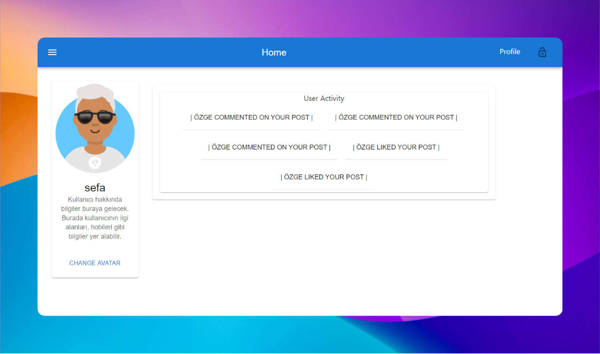
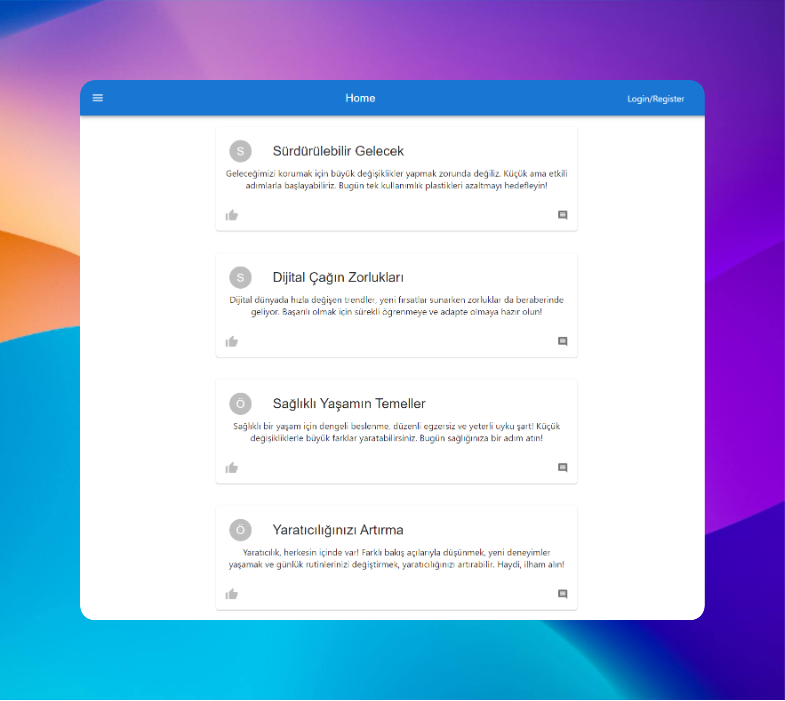
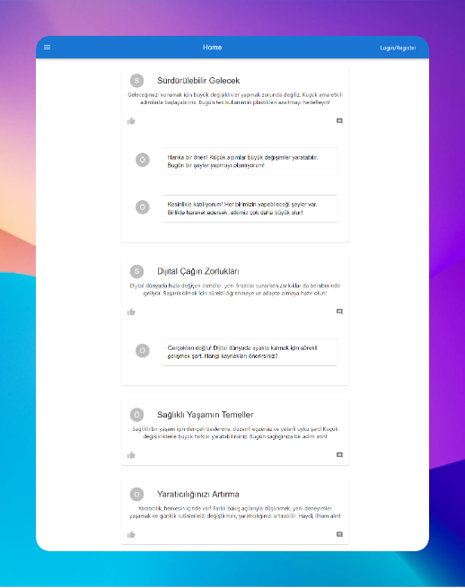
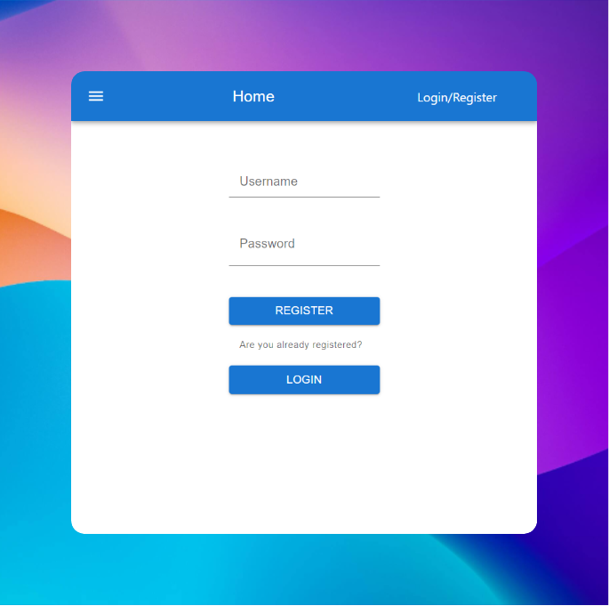

# QuestionApp (Full Stack Application)

QuestionApp, kullanıcıların tartışmalara katılabileceği, içerik paylaşabileceği ve gönderileri yönetebileceği bir platform olarak tasarlanmış Java tabanlı bir web uygulamasıdır. Bir forum veya blog gibi işlev görerek, etkileşim ve içerik yönetimi için kullanıcı dostu bir arayüz sunar.

## Özellikler

- **User Accounts:** Sign up, Log in ve profil yönetimi(Avatar değiştirme, hakkında yazısı vb.).
- **Forum Tarzı Tartışmalar:** Konular oluştur, yanıtlar gönder ve sohbetlere katıl.
- **Blog Posts:** Makaleler yayınla ve gönderilere yorum yap.
- **Arama İşlevselliği:** Gönderileri ve tartışmaları kolayca bul.
- **Responsive Design** Hem masaüstü hem de mobil cihazlar için optimize edilmiştir.

## Projede kullanılan teknolojiler

- Spring boot
- React
- MySQL

## Note

- Frontend linki: https://github.com/Sefa-bulut/socialMediaApp-Fronted-
- Backend linki: https://github.com/Sefa-bulut/socialMediaApp-Backend-

### Uygulama Hakkında Bazı Görseller

    

        
    

    

        
    

    

        
    

    

        
    

